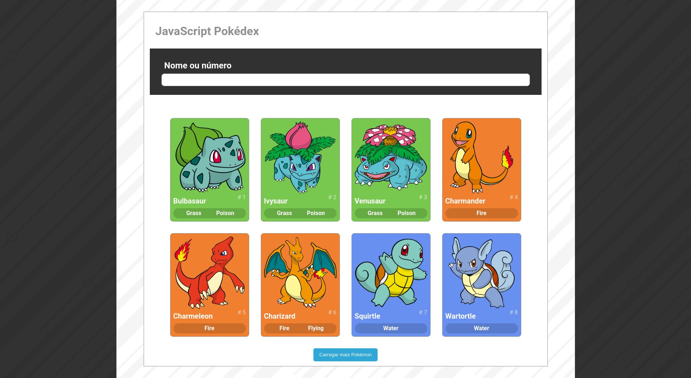

# JavaScript Pokedex 

Desenvolvimento de uma _Pokédex_ consumindo uma API RESTful por meio da linguagem javascript.

## Technologies

- HTML5
- Sass
- JavaScript
- Responsive web design with media queries.